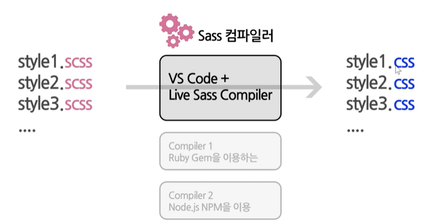
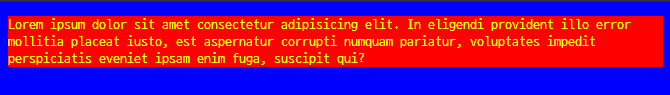

# Sass와 SCSS 소개

> CSS 작성을 위한 작고 가벼운 언어입니다.

- `Sass` : SCSS와 작성하는데 있어서 구조적 차이가 있고 작성이 번거롭고 복잡할 수 있다.

- `SCSS` : 기존에 알던 CSS와 유사하게 작성할 수 있기 때문에 친근하게 느껴져 배우기가 쉽다.


## SCSS

### 1. 컴파일 해보기

- VS Code에서 익스텐션인 Live Sass Compiler를 사용합니다 :D




- 컴파일을 하는 방법은 다음과 같습니다.

  - / index.html 파일 생성

    ```html
    <!DOCTYPE html>
    <html lang="en">
    <head>
      <meta charset="UTF-8">
      <meta http-equiv="X-UA-Compatible" content="IE=edge">
      <meta name="viewport" content="width=device-width, initial-scale=1.0">
      <title>Document</title>
    </head>
    <body>
      
    </body>
    </html>
    ```

  - scss / test.scss 파일 생성

    ```scss
    body {
      font-size: 14px;
      background-color: azure;
    }
    ```

  - VScode 하단의 watch sass 누르기 (익스텐션인 Live Sass Compiler 설치해야 보입니다.)

  - scss / .css 파일 확인하기

  - html 파일 ref 추가 & Live Server로 html 열기

    ```html
    <!DOCTYPE html>
    <html lang="en">
    <head>
      <meta charset="UTF-8">
      <meta http-equiv="X-UA-Compatible" content="IE=edge">
      <meta name="viewport" content="width=device-width, initial-scale=1.0">
      <title>Document</title>
      <link rel="stylesheet" href="sass/test.css">
    </head>
    <body>
      <p>Lorem ipsum dolor sit amet consectetur adipisicing elit. In eligendi provident illo error mollitia placeat iusto, est aspernatur corrupti numquam pariatur, voluptates impedit perspiciatis eveniet ipsam enim fuga, suscipit qui?</p>
    </body>
    </html>
    ```

  - scss 파일 내용을 변경하여 => css를 자동으로 변경하게 합니다.

    ```html
    // index.html
    	<p id="box">Lorem ipsum dolor sit amet consectetur adipisicing elit. In eligendi provident illo error mollitia placeat iusto, est aspernatur corrupti numquam pariatur, voluptates impedit perspiciatis eveniet ipsam enim fuga, suscipit qui?</p>
    ```

    ```html
    // test.scss
    
    #box {
      background-color: blueviolet;
    }
    ```

  - 변수를 활용하여 할당하기

    ```scss
    // test.scss
    
    $color-blue: #00f;
    $color-red: #f00;
    $color-yellow: #ff0;
    
    body {
      font-size: 14px;
      background-color: color-blue;
    }
    
    #box {
      color: $color-yellow;
      background-color: $color-red;
    }
    ```

  - 결과

    


### 2. 실습하기

#### 2.1. 변수

```html
<!DOCTYPE html>
<html lang="en">
<head>
  <meta charset="UTF-8">
  <meta http-equiv="X-UA-Compatible" content="IE=edge">
  <meta name="viewport" content="width=device-width, initial-scale=1.0">
  <title>Document</title>
  <link rel="stylesheet" href="css/vars.css">
</head>
<body>
  <!-- div#box-$*5 -->
  <div id="box-1">box 1</div>
  <div id="box-2">box 2</div>
  <div id="box-3">box 3</div>
  <div id="box-4">box 4</div>
  <div id="box-5">box 5</div>
</body>
</html>
```

```scss
// var
$color-white: #fff;
$color-black: #000;
$color-gray: #ccc;
$color-gray-light: #efefef;
$color-red: #f00;
$color-blue: #00f;

$border-color: $color-blue;
$bg-color: rgba($color-black, 0.5);

body {
  background-color: $bg-color;
}

#box-1 {
  color: #ff0;
  background-color: $bg-color;
  width: 100px;
}

#box-2 {
  color: #f00;
  background-color: $bg-color;
  width: 100px;
}

#box-3 {
  color: #ff0;
  background-color: $bg-color;
  width: 300px;
}

#box-4 
  color: #f00;
  background-color: $bg-color;
  width: 300px;
}

#box-5 {
  color: #0f0;
  background-color: $bg-color;
}
```


#### 2.2. 기초 문법

```html
<!DOCTYPE html>
<html lang="en">
<head>
  <meta charset="UTF-8">
  <meta http-equiv="X-UA-Compatible" content="IE=edge">
  <meta name="viewport" content="width=device-width, initial-scale=1.0">
  <title>Document</title>
  <link rel="stylesheet" href="css/sass-basics.css">
</head>
<body>
  <div id="box-1">
    box-1
    <br>
    <a href="#">button1</a>
    <div id="box-2">
      box-2
      <br>
      <a href="#">button2</a>
    </div>
  </div>
  
</body>
</html>
```

```scss
html {
  font-size: 18px;
}

body {
  margin: 20px;
  background-color: #fff4cf;
}

div {
  color: #333;
  padding: 20px;
}

a {
  display: inline-block;
  margin: 10px 0;
}

#box-1 {
  font-size: 40px;
  background-color: #ffcccc;
  border-radius: 20px;
  border: 3px solid #f00;
  box-shadow: 0px 3px 11px 0px rgba(0, 0, 0, 0.75);
}


#box-1 > a {
  color: #a22;
  text-decoration: none;
}

#box-1 > a:hover {
  color: #000;
  text-decoration: underline;
}

#box-1:hover {
  background-color: #ccc;
}

#box-1 #box-2 {
  font-size: 20px;
  background-color: #e9e9e9;
  
  border-radius: 20px;
  border: 3px solid #f00;
  box-shadow: 0px 3px 11px 0px rgba(0, 0, 0, 0.75);
}

#box-1 #box-2 > a {
  color: #ee6633;
  text-decoration: none;
}

#box-1 #box-2 > a:hover {
  color: #a22;
  text-decoration: underline;
}
```


#### 2.3. Nesting

- `&` : 현재 자신의 속성

```scss
#box-1 {
  font-size: 40px;
  background-color: #ffcccc;
  border-radius: 20px;
  border: 3px solid #f00;
  box-shadow: 0px 3px 11px 0px rgba(0, 0, 0, 0.75);

  // 모든 자손 a에 대한 스타일을 지정하게 됩니다.
  a {
    color: #a22;
    text-decoration: none;
  }
  // &는 현재 자신의 속성을 지칭합니다 따라서 현재 속성에서 > a 자식만 선택합니다.
  & > a {
    color: #a22;
    text-decoration: none;
  }
}
```

```scss

#box-1 {
  font-size: 40px;
  background-color: #ffcccc;
  border-radius: 20px;
  border: 3px solid #f00;
  box-shadow: 0px 3px 11px 0px rgba(0, 0, 0, 0.75);

  // &는 현재 자신의 속성을 지칭합니다 따라서 현재 속성에서 > a 자식만 선택합니다.
  & > a {
    color: #a22;
    text-decoration: none;
	// box-1 > a:hover에 대한 속성을 nesting을 통해 지정할 수 있습니다.
    &:hover {
      color: #000;
      text-decoration: underline;
    }
  }
}
```

```scss

#box-1 {
  font-size: 40px;
  background-color: #ffcccc;
  box-shadow: 0px 3px 11px 0px rgba(0, 0, 0, 0.75);

  &:hover {
    background-color: #ccc;
  }

  // #box-1과 #box-1-title 공통 속성
  &, &-title {
    border-radius: 20px;
    border: 3px solid #f00;
  }

  // #box-1-title
  &-title {
    font-style: italic;
    text-decoration: underline;
  }


  // 모든 자손 a에 대한 스타일을 지정하게 됩니다.
  // &는 현재 자신의 속성을 지칭합니다 따라서 현재 속성에서 > a 자식만 선택합니다.
  & > a {
    color: #a22;
    text-decoration: none;
    &:hover {
      color: #000;
      text-decoration: underline;
    }
  }
}

#box-1 #box-2 {
  font-size: 20px;
  background-color: #e9e9e9;
  
  border-radius: 20px;
  border: 3px solid #f00;
  box-shadow: 0px 3px 11px 0px rgba(0, 0, 0, 0.75);

  & > a {
    color: #ee6633;
    text-decoration: none;

    &:hover {
      color: #a22;
      text-decoration: underline;
    }
  }
}
```


#### 2.4. Nesting - Media Queries

> 미디어 View Port 에 따른 화면을 다르게 보여주어야 할 때 사용됩니다.

```scss

@media screen and (max-width: 500px) {
  #box1 {
    font-size: 14px;
  }
}

@media screen and (min-width: 501px) and(max-width: 900px) {
  #box1 {
    font-size: 24px;
  }
}
```


#### 2.5. mixin

> mixin : 여러 css 속성을 하나로 묶을 수 있습니다.

- `@mixin`
- `@include`

```scss
//mixin
@mixin fontSizeBgColor($fontSize: 20px, $bgColor: #ffff) {
  font-size: $fontSize;
  background-color: $bgColor;
}

#box-1 {
  // font-size: 40px;
  // background-color: #ffcccc;
  @include fontSizeBgColor(40px, #ffcccc);
  ...
}

#box-1 #box-2 {
  // font-size: 20px;
  // background-color: #e9e9e9;
  @include fontSizeBgColor(20px, #e9e9e9);
  ...   
}

#box-3 {
  // 기본 인자를 그대로 사용합니다.
  @include fontSizeBgColor();
}
```

```scss
@mixin linkStyle($textColor, $textDeco: none) {
  color: $textColor;
  text-decoration: $textDeco;
}

#box-1 {
    ...
    
	& > a {
    // color: #a22;
    // text-decoration: none;
    @include linkStyle(#a22);

    &:hover {
      // color: #000;
      // text-decoration: underline;
      @include linkStyle(#000, underline);
    }
  }
}
```


#### 2.6. extend

> 속성이 완전히 동일한 경우 extend를 통해 지정합니다.

- `%`
- `@extend`

```scss
// extend
%boxShape {
  border-radius: 20px;
  border: 3px solid black;
  box-shadow: 0px 3px 11px 0px rgba(0, 0, 0, 0.75);
}
```

```scss
#box-1 {
  // border-radius: 20px;
  // border: 3px solid grey;
  // box-shadow: 0px 3px 11px 0px rgba(0, 0, 0, 0.75);
  @extend %boxShape;
  ...
}


#box-1 #box-2 {
  @extend %boxShape;
  ...
}
```


#### 2.7. partial

> scss 공통적인 소스코드를 partial로 나누어 별도의 파일로 저장하는 기술입니다.

- 파일명을 _(언더스코어)로 시작하는 파일은 컴파일이 되지 않습니다.
- `@import`

```scss
// _mixins.scss

// mixin
@mixin fontSizeBgColor($fontSize: 20px, $bgColor: #ffff) {
  font-size: $fontSize;
  background-color: $bgColor;
}

@mixin linkStyle($textColor, $textDeco: none) {
  color: $textColor;
  text-decoration: $textDeco;
}
```

```scss
@import "mixins";

#test {
  @include fontSizeBgColor(100px, #999);
}
```

```scss
// partial/_style.scss

%boxShape {
  border-radius: 20px;
  border: 3px solid black;
  box-shadow: 0px 3px 11px 0px rgba(0, 0, 0, 0.75);
}
```

```scss
@import "mixins";
@import "partial/styles";

#test {
  @include fontSizeBgColor(100px, #999);
  @extend %boxShape;
}
```


#### 2.8. if

- 어떤 경우를 조건으로 분기하는 프로그래밍적 기능을 제공합니다.

```scss
body {
  margin: 50px;
}

@mixin textAndBgColor($textColor, $bgColor) {
  color: $textColor;
  background-color: $bgColor;
}

@mixin theme($mood) {
  @if $mood == 'light' {
    @include textAndBgColor(#333, #ff0)
  }
  @else if $mood == 'dark' {
    @include textAndBgColor(#fff, #000)
  }
  @else {
    @include textAndBgColor(#f00, #aaa)
  }
}

#box-1 {
  @include theme('light')
}
#box-2 {
  @include theme('dark')
}
#box-3 {
  @include theme('default')
}
```

